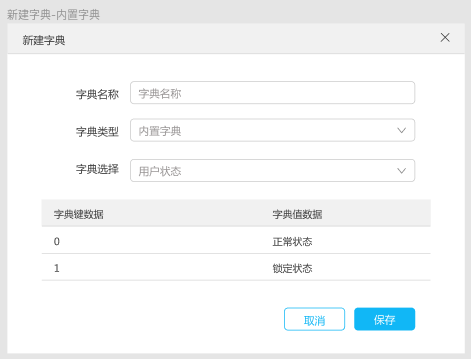
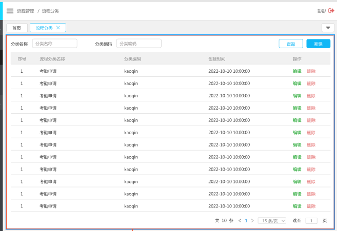
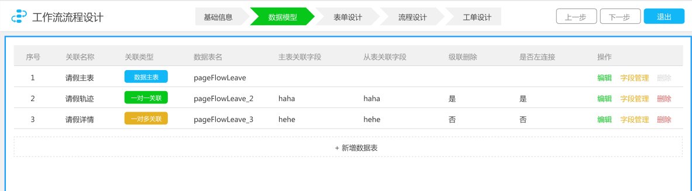
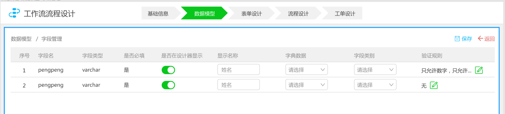

# 工作流

　　工作流组件（下简称‘组件’）为应用系统赋予快速开发流程类需求的能力。流程类需求的首选开发途径是基于工作流引擎，此类开发的要点是如何将工作流引擎的动能转化为目标业务系统的驱动力，推动工作流程运行。工作流组件的定位是在工作流引擎和业务系统之间的连接，使业务系统无需直接面对工作流引擎复杂的底层逻辑而是通过相对简单的延展开发来满足流程任务的需求。 　　

## 开发背景

首先工作流的定义是：

> 工作流（Workflow）是指“业务过程的部分或整体在计算机应用环境下的自动化”。工作流主要解决的主要问题是：为了实现某个业务目标，利用计算机在多个参与者之间按某种预定规则自动传递文档、信息或者任务。

　　用白话说就是为了完成一个较大的工作目标，往往需要将其分解为若干小的工作任务，而工作流就是将这些小的工作任务串联在一起的线，“工作处理”在这根线上游移。工作流这根线上会设置业务逻辑，其作用是根据流程上各个工作任务的完成情况将 “工作处理”推进到特定位置。

　　业务流程模型和标记法（BPMN, Business Process Model and Notation）是一套图形化表示法，用于以业务流程模型详细说明各种业务流程。工作流引擎是遵循BPMN规范，为实现流程任务需求而设计的软件框架。通常使用工作流引擎来开发实现流程类的需求。工作流引擎有多种开源软件，Activiti是Java开源是主要流派，其大概主要分为两个功能：**流程设计**和**流程运行**。 　　 　　工作流引擎是一种较为复杂的开发框架，学习曲线陡峭，同时对开发人员的技术水平也有一定要求，主要是因为：

1. 外部的业务数据是变化、动态，不确定的，某些数据甚至必须要由工作流运行在一定的过程才能够取得，在流程设计过程中，外部数据是无法准确获取的，非常可靠地和及时的获取这些外部数据本身就是一个难题；
2. 工作流引擎的流转控制机制与外部动态数据之间是互相分离的，两者之间无法做到同步相关，要实现流转控制与外部动态数据之间的互操作，需要构建数模关系，并依据这些关系来编程实现，这对普通JAVA程序员有一定的难度；
3. 考虑到公司普通程序员的整体技术水平和目前项目的定价风格，雇用高水平的程序员按照现场分析-数学建模-编写代码的三步方式来解决问题是不现实的。

　　工作流组件作为连接工作流引擎和业务系统之间的桥梁，使业务系统的开发人员不必深入学习工作流引擎的技术细节，通过配置界面的操作即可将业务数据接驳到工作流引擎的控制体系之中。 开发人员当然也可以利用工作流组件提供的二次开发的接口实现对流程更精细的控制，或者添加自定义的流程逻辑。

## 需求概要

　　工作流组件是包含前、后端内容以及关系型数据库表的复合型业务组件。从形式上需要提供如下内容：

1. 工作流配置管理模块，包含前端页面和后端RESTFUL接口。并提供安装集成文档。应用系统可按自身要求将其整体或部分集成；
2. 用于二次开发的接口规范。用于后端开发人员定制开发；
3. 组件关系型数据库建表脚本

组件的业务功能包括“流程管理”和“流程应用”。下面就以上两项功能展开描述。

### 流程管理

流程管理面向业务管理人员用户，用以设计业务流程及其围绕流程服务的其它信息，主要分为：

#### 字典管理

　　数据字典是指表单所用到的数据表结构、及其字段信息和字段属性的维护管理表单。在组件中，字典一般用于定制表单中输入项的规定项。字典按照来源形式或组织形式分为3类:
　　
1. 数据表字典\
　　用特定形式的sql从数据表中得到一组数据作为字典，数据中包含了字典的逻辑值字段和显示名称字段。例如可以从职务表中获得职务信息的数据字典。
2. 枚举字典\
　　人为定制一组形式为键-值的数据对作为字典。例如性别可以定义为 0-女|1-男。
3. 内置字典\
　　一些约定俗成的或是在业务中固定存在的键-值对的集合。例如用户状态通常只存在 0-停用|1-正常|2-异常 这几个状态，因此可以将其视为内置字典

在字典管理中可查阅已创建字典的列表，并对字典进行增删改操作。只能删除未被使用的数据字典（数据字典和对应的表单之间是引用的关系，单方面的删除数据字典会导致表单数据的损坏，故有此限制）。

#### 流程分类

　　分类是流程定义的元数据之一，将流程分类可使数据组织有秩序。该功能的默认视图是已存在分类的列表。可指定“分类名称”和“分类编码”以创建新的分类，也可编辑和删除已有分类信息。无法直接删除已使用的分类（即该分类下已有流程定义存在），需要先删除该分类下的所有流程定义后再删除分类。

#### 流程管理

　　对流程定义的管理是组件的最核心功能。（具有流程管理权限的）用户可创建新的流程定义及查阅管理系统中已定义的流程。 　　

**创建新流程**

流程的定义较复杂，用向导的形式将创建过程分为5个步骤：

填写流程基础信息 -> 建立数据模型 -> 设计流程表单 -> 设计流程逻辑 -> 设计工单 ，下面逐一说明。

1. 填写流程基础信息\
   填写流程的名称、编码、分类和可见权限这几个基础信息。
   
2. 建立数据模型

　　数据模型的作用是描述一个具体工作任务所需的一个或多个业务数据表以及表之间的关系的对象。数据模型是工作流中表单的数据流向，可以大致的理解为填写的表单的信息保存去处。建立数据模型的第一个步骤是建立业务主表。每个数据模型能且只能设置一个作为数据核心的业务主表。围绕主表可建立和维护与之对应的关联表，主表和关联表有一对一或者一对多的关系（基于业务实际，多对一或多对多的情况很少见，故暂时不予考虑）。用户通过字段管理功能来提供数据模型中的的每个表的字段信息。

编辑字段信息时，程序可以通过数据库的元数据给出表字段的大概样貌，用户只需在此基础上补充名称、校验规则等主观信息。\

3. 设计流程表单 \
   组件里通过表单将工作流程和具体业务连接到一起。

4. 设计流程逻辑 \
   asdkjfl;asdj;lasjd;lkj;laskjas;dkj

5. 设计工单 \
   asdj;laskd;lkj3eklj;\
   啊三等奖;啊看见3叫哦万接\
   啊的角色昆仑决

#### 流程实例管理

### 流程应用

#### 发起流程

#### 我的流程

#### 待办任务

#### 已办任务

应用组件的业务系统可按照实际需要自行灵活配置上述功能的位置。
