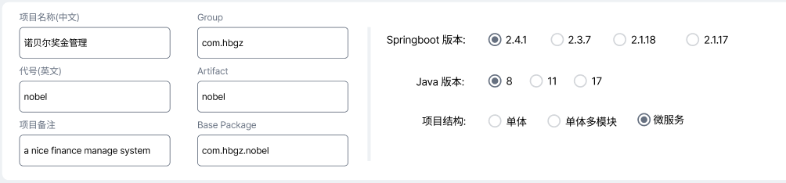
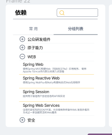
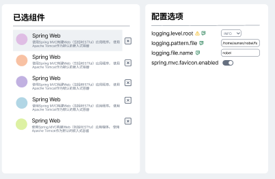

# 工程脚手架配置工具

　　工程脚手架配置工具是提供图形界面的应用程序，用于生成工程脚手架代码。该工具是工程脚手架的配套设施。

## 项目背景

　　"项目脚手架"只是一套静态的基础代码结构，开发人员拿到项目脚手架后需依照开发项目的实际需要剪裁或增添内容。这种后期调校要求开发人员有一定的架构组织能力，门槛较高。同时手工的作业方式在面对大量的零散的配置和源码，管理复杂，出错的几率极高。采用图形界面的配置工具代替手工方式，可以避免失误。另一方面也降低了使用难度，使普通的开发人员也能搭建项目脚手架。该配置工具还具有保存能力，可加载复用之前的工程脚手架配置方案。该工具提供丰富的配置注解，可引导开发人员完成工作目标，同时也不失为学习项目配置和架构搭建的实验教具。

## 需求概要

　　该配置工具的总体目标是以图形化的方式引导使用者逐步配置，最终输出合适可用的工程脚手架代码。为实现目标，可将使用分解为如下步骤：

1. 配置工程的基本信息

工程基本信息包括：

　　项目名称和项目备注：便于开发人员的阅读理解。

　　代号：当与其它系统（如devops的构建流水线）发生关系时，作为项目的唯一标识

　　Group & Artifact：maven的依赖管理组织代码

　　Springboot 版本：项目开发所基于的springboot版本。各版本之间存在一定的兼容性差异

　　Java版本：项目开发所需的最低Java版本。8使用最广泛，17是最新发布版本

　　项目结构：工程脚手架的基本结构，要根据项目的业务复杂度，开发方式，开发团队组织等多方面综合考虑。

- 普通单体应用适合规模小，逻辑简单，开发人员不多的项目
- 当需求的业务逻辑复杂度达到需要分成若干模块时，适合使用多模块单体结构
- 当项目的复杂度进一步加大，业务逻辑需要拆分成微服务时，使用微服务底座

以上工程的基本信息的会输出到工程的顶层POM文件的对应部分中。

2. 选择搭建脚手架所需的依赖

　　在依赖备选面板勾选所需的依赖。所选依赖将反映到生成的脚手架代码的配置文件中，其中具备配置项的依赖可以在下一步的配置项管理中处理。用户可以按分类的方式探索组件库或者直接以模糊条件启发式的查询所需依赖。
　　组件按四种类型入库，有安全组件、功能组件、业务组件和互联网生态组件：
　　
- 安全组件顾名思义不赘述；
- 功能组件是封装面向技术层面、面向较为单一问题域的工具集合&类库；
- 业务组件面向解决较为复杂但具有通用问题域的业务问题。因此其成分相对前面两种类型的组件要复杂，使用方式可能涉及编写配置文件项、源码二次开发等，因此需要更多的文档说明甚至培训时间。尽管使用成本较高，但考虑到成功使用业务组件后能带来大幅开发效率提升和降低技术风险的可能，应尽可能使用业务组件；
- 互联网生态组件整合著名互联网厂商提供的开发能力(平台)，尽可能提供统一的开发界面和使用模式，降低开发人员的使用成本。同时还能统一管理公司级的开发账号。

　　根据最佳实践，采用版本锁定(dependency management)的方法来避免因显式选择的依赖和传递性的依赖的重复而造成的版本冲突，故在依赖选择时无需指定版本，按maven管理版本选择顺序依次为 在pom中显式指出版本 -> 备选依赖录入时设置的参考版本 -> springboot的版本管理配置文件 。

3. 取消已选择的组件

用户界面的“已选择组件”面板用于罗列已选择的组件。用户在该面板中对组件项执行取消选择操作。
　　
4. 定制组件功能
　　某些组件提供配置和扩展能力，用户可据此定制组件的功能以满足实际需求。在“已选择组件”面板中选择需要具有定制能力的组件，该组件的定制界面在“功能定制”面板中展开。对于组件的定制有如下几种形式：
- 源码配置文件中的配置项
- 源代码中的注解
- 在特定的源码文件中增加代码片段
- 选择接口的不同实现

　　对于一些行为复杂的业务组件，难以单纯的使用定制满足实际需求，需要在获得脚手架代码后再行线下配置或开发。这时需要在配置界面提供简明扼要的使用说明或技术文档，使用户尽快获得对这些业务组件的使用知识。

5. 配置分享
　　通过分享用户可将脚手架代码的配置分享给其他用户。另外， 配置工具本身不提供保存功能，使用分享还可以客观上起到恢复之前已配置过的脚手架代码的效果。

## 技术架构

