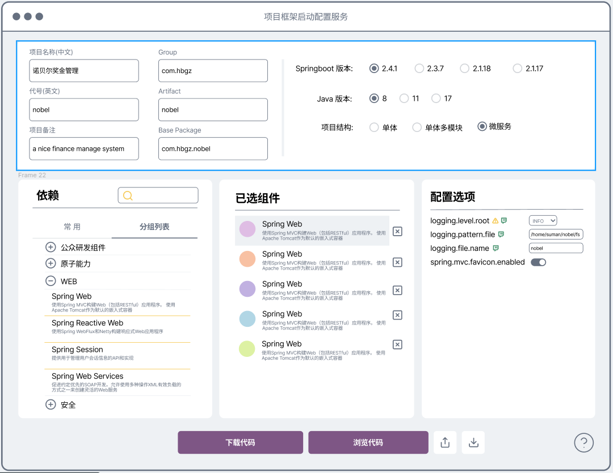

# 自研项目脚手架

　　开发人员俗称的"项目脚手架"是对建筑行业中的脚手架的类比，是指一类包含有在开发过程中使用的开发工具、开发框架，目录结构的特殊软件项目，其中不包含或仅包含少量具有共性的业务逻辑。脚手架项目使得开发人员无须从头开始搭建或者编写底层代码，是新项目开发的绝佳起点。我们所言的自研项目脚手架（下简称“项目脚手架”）主要目标是提供基础的项目结构。进一步，在其上配置常用依赖、通用的业务组件甚至某些高可复用的业务逻辑代码。一个结构良好，功能完备的项目脚手架可为项目整个开发周期夯实基础。
　　
## 开发背景

　　据了解，目前公司各生产部门有四种方式获得新项目的项目脚手架：
1. 由架构师或具备架构能力的开发人员手工搭建；
2. 通过修改/清洗以往的项目;
3. 使用网上的项目初始化服务,如 [spring initialize](https://start.spring.io/);
4. 寻找使用开源的脚手架方案，比如比翼研发框架、若依

在实践中这几种方式都能获得不错的效果，但同时也存在缺憾，表现在：

- 缺乏统一性
使用不同的项目脚手架会造成项目结构的差异、配置文件风格化以及针对同一问题出现不同的技术解决方法等。x想象一下如果战争中士兵们使用不同制式的武器装备、用不同的密码通讯将是什么局面。公司在技术管理上也是这样，统一的技术口径能有效降低管理成本，反之则造成混乱。

- 效率问题
原始项目脚手架通常都是“粗粝”的，需要按项目实际状况手工调校。在实践中，这个过程耗费时间，同时难以保证完全正确，漏项、重复或无效配置时有发生。对于稍复杂的项目脚手架，还需在完成调校后耗时对项目团队宣导。

- 重复建设和重复学习
由于选择太多，开发人员不得不花时间熟悉不同的项目脚手架，时间或长或短，这对开发人员而言是可以节省的重复学习，而采用一个相对统一的框架则会避免这种重复。

- 与本地资源的匹配性
在集团和公司大力宣导开发上云的大环境下，需要项目的基础配置和公司提供的云基础设施如原子能力、云道等相匹配。常规通用型的脚手架方案难以实现这个目标。

　　综上而言，开发兼顾规范、效率同时也能满足公司实际管理要求的项目脚手架是有必要的。

## 需求概述

　　自研的项目脚手架应提供用于能快速进入实际开发的基础代码。该基础代码需精心编撰，其结构需符合当前主要的JavaEE开发规范同时也应包含开发中的最佳实践。项目脚手架应提供多个派生版本以满足不同体量和组织方式的项目实际需求。

　　在项目脚手架的代码或配置文件中要留下明确的路标，指导开发人员在展开框架后可方便的按实际项目需求切入开发及增加更多的内容。

　　
## 设计原则

　　项目脚手架将按照如下原则组织开发：形式统一、易用，规范且精炼、功能完备，拓展性强。

### 形式统一
以 maven 约定的默认项目结构为基础，按照前后端分离的主流开发形式派生出三套满足不同业务规模的框架：普通单体应用、多模块单体应用和微服务：

- 普通单体框架适合规模小，逻辑简单，仅有少数开发人员参与的项目；
- 当业务逻辑足够复杂，需要分成若干模块时，使用多模块单体结构框架；
- 项目的复杂度进一步加大，业务逻辑需要拆分成微服务时，使用微服务框架

在此三套初始项目框架能满足绝大部分项目启动需求的前提下，出台管理办法或建议，对各部门的新项目开发提出要求，以此达到统一的管理目标。

### 易用
开发用于搭建配置的在线服务，采用图形化界面，大幅降低搭建框架所需的技术门槛。在配置的同时也提供丰富详实的技术说明，使配置服务既是工具也是学习平台。

### 规范且精炼
继承于JavaEE开发的事实标准-springboot的依赖管理。使用配置服务在搭建框架的过程中动态识别传递的依赖项，避免配置文件中出现不必要的配置项，保持配置文件的整洁及可读性。

### 功能完备
提供丰富的功能组件和业务组件。包括引用部分原子能力组件。覆盖开发中常见的技术点。组件库具备维护功能，可下放权限，使各生产部门也能方便添加更多组件。

### 拓展性强
在业务组件中预先设计和提炼出扩展点。当组件的默认实现无法满足应用项目的业务要求时通过扩展点的二次开发来实现目标。部分定制性较强的组件还提供配置项来设置组件的行为。

